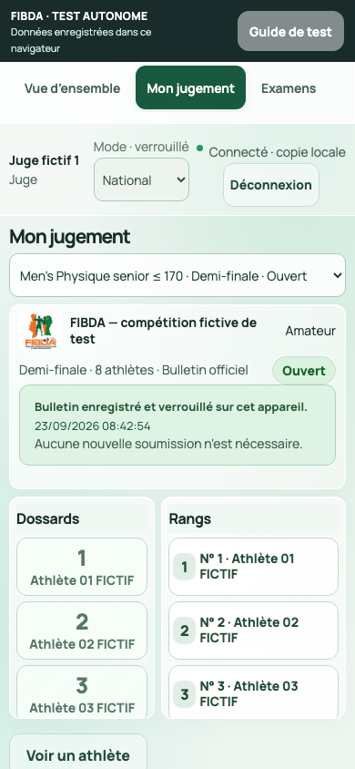
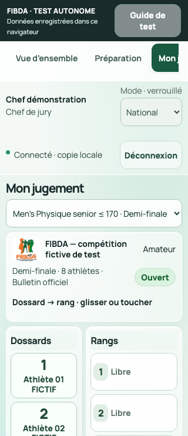
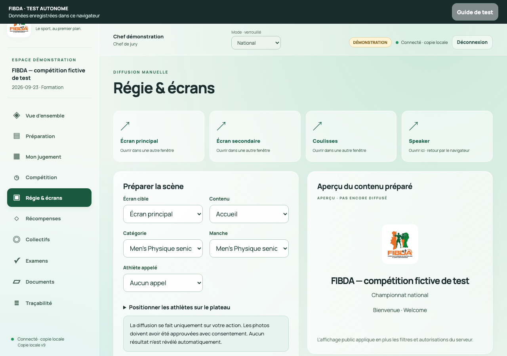

# FIBDA — vérification du HTML autonome

Version remise le 23 septembre 2026. Le fichier reprend l’application existante et ses parcours avec un moteur Python embarqué, des données fictives et un stockage propre au navigateur. La proposition design distincte sur le port 8771 n’est pas intégrée.

## Fichier contrôlé

- Nom : `FIBDA-application-autonome.html`.
- Taille : **20 119 122 octets**, soit environ 20,1 Mo.
- SHA-256 : `9ff5389ab1476835233ae96679a5863980fd8ecde47ad419007c7f333a89aea6`.
- Ouverture de recette : fichier local réel dans Chromium, sans serveur FIBDA ; copie de recette identique octet par octet au livrable.
- Le manifeste joint identifie aussi les sources originales et adaptées. Les données saisies pendant les tests restent dans le navigateur de recette, hors du fichier remis.

## Résultats constatés

| Contrôle | Résultat | Preuve |
|---|---|---|
| Moteur Python et pont autonome | 24 tests réussis, zéro erreur, échec ou test ignoré | [Résultats WASM](preuves/fibda-wasm-tests.json) |
| Parcours de stockage et documents | 11 contrôles réussis | [Résultats navigateur](preuves/fibda-browser-proof.json) |
| Classement dans l’interface | 9 contrôles réussis à 390 px | [Résultats interface](preuves/fibda-ui-proof.json) |
| Persistance du bulletin reçu | Verrouillage et commandes désactivées conservés après rechargement | [Résultat de rechargement](preuves/fibda-reload-proof.json) |
| Largeur 320 px | Dix rubriques sans débordement horizontal global | [320 px](preuves/fibda-responsive-320.json) |
| Largeur 390 px | Dix rubriques sans débordement horizontal global | [390 px](preuves/fibda-responsive-390.json) |
| Largeur 768 px | Dix rubriques sans débordement horizontal global | [768 px](preuves/fibda-responsive-768.json) |
| Largeur 1280 px | Dix rubriques sans débordement horizontal global | [1280 px](preuves/fibda-responsive-1280.json) |
| TypeScript de la copie adaptée | Aucune erreur | [Compte rendu](preuves/typescript.txt) |
| Reconstruction des sources | HTML identique localement et depuis une extraction sans Git ni compilation antérieure | [Preuve de reconstruction](preuves/fibda-source-rebuild-proof.json) |
| Runtime minimal, contrôle séparé | 15 tests originaux, aller-retour XLSX et absence de ressources externes observées | [Preuve runtime distincte](preuves/runtime-proof-results.json) |

Les 24 tests couvrent notamment le cycle de compétition, le classement national, les qualifications communes, l’overall et les récompenses, l’attente et le délai des stagiaires, les accès par rôle, les corrections publiées à deux signatures, les imports/exports et la restauration. Ils utilisent le moteur Python/WASM du navigateur, sans réseau de compétition.

Les 11 contrôles navigateur vérifient la connexion à quatre chiffres et les 24 personnes initiales fictives, le recadrage et l’approbation d’une photo synthétique, l’import CSV, l’export Excel binaire, les bulletins vierges séparés par catégorie, la sauvegarde ZIP et sa restauration avec photo conservée. Une panne de stockage simulée ne produit ni confirmation trompeuse ni modification conservée. Aucune requête HTTP externe n’a été observée pendant ce parcours.

Le contrôle d’interface utilise l’alternative « toucher le dossard puis le rang », par clics automatisés : remplacement sans décalage, annulation de l’opération entière, rétablissement, complétude, résumé avant envoi, réception et verrouillage. Il ne prouve pas la qualité du glisser-déposer sur un téléphone physique.

Les rubriques visitées pour la largeur sont : vue d’ensemble, préparation, jugement, compétition, régie, récompenses, collectifs, examens, documents et journal. Ce contrôle porte sur les états visités, pas sur chaque formulaire, fenêtre ou effectif possible.

## Revue et corrections

Une revue indépendante a vérifié l’adaptateur, les limites documentées et la composition des archives. Les protections de concurrence locale comprennent une écriture conditionnelle atomique IndexedDB, la sérialisation du démarrage et de la réinitialisation, et la confirmation après la fin de la transaction. L’écran speaker conserve sa session dans le même onglet ; les écrans publics peuvent s’ouvrir séparément.

Le débordement de l’en-tête à 320 px a été corrigé dans la copie autonome ; le nom du juge et les actions passent sur deux lignes. Les captures téléphone, petit téléphone et ordinateur ont été examinées visuellement. La version serveur et ses données n’ont pas été modifiées par cette adaptation.

La reconstruction par le développeur fonctionne également sans dépôt Git. La configuration TypeScript est régénérée à chaque construction : une extraction propre produit exactement le même HTML. Le commit d’un éventuel dépôt parent n’est pas repris comme provenance de l’application extraite.

Les scripts navigateur de reproduction accompagnent les preuves. Le contrôle des bulletins « participants à confirmer » est effectué après la génération du programme, lorsque ces tours existent réellement.

## Captures du fichier contrôlé

### Téléphone, bulletin reçu

### Petit téléphone

### Ordinateur

## Limites de cette remise

**Ce HTML permet des essais indépendants ; il ne synchronise pas plusieurs appareils.** La synchronisation entre juges et poste central, l’autorité du serveur, le réseau de salle et la sauvegarde SQLite restent propres à la version serveur. La sauvegarde ZIP autonome n’est pas interchangeable avec celle du serveur.

Le document contient les fonctionnalités déjà présentes et leurs adaptations locales. Il ne constitue pas une preuve que toutes les exigences du projet sont réceptionnées. Les limites de l’application serveur sont détaillées dans le dossier développeur, notamment `docs/STATUT-LIVRAISON.md`.

Restent à tester : Safari sur iPhone/iPad, Chrome Android et autres navigateurs cibles sur appareils physiques ; gestes tactiles ; mémoire et durée de chargement ; téléchargements et réouverture du HTML ; impression réelle ; confort avec de grands groupes. Les contrôles actuels ne couvrent pas exhaustivement la concurrence entre onglets.

Sur téléphone, utiliser de préférence un hébergement HTTPS stable : les aperçus de pièces jointes peuvent ne pas exécuter un fichier HTML. Le fichier est autoportant, mais le comportement des navigateurs et de leur stockage varie. Aucune compatibilité universelle n’est annoncée.

Les codes sont publics. N’utiliser que des données et photos fictives dans ce kit. La réception sportive, matérielle et fédérale demeure à réaliser sur la version de compétition.
