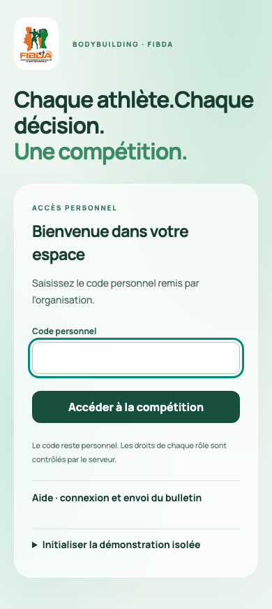
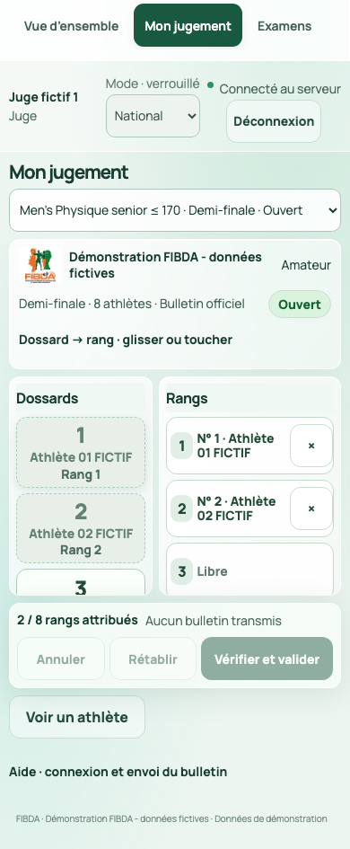
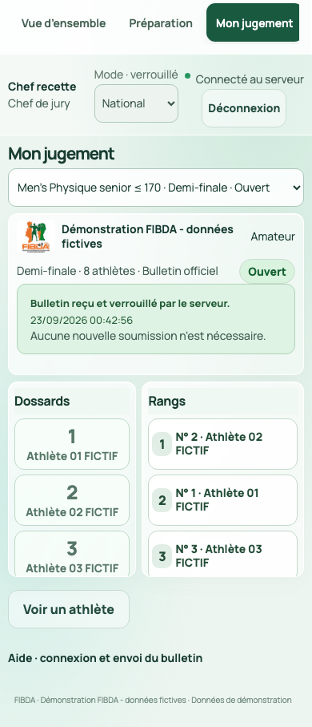

# Téléphones des juges : connexion et synchronisation

Le parcours courant tient en trois gestes : ouvrir son bulletin, classer les dossards, valider. Le juge confirmé et le stagiaire arrivent directement dans « Mon jugement » après leur connexion. Les outils de préparation restent réservés aux personnes habilitées. L'aide est repliable.

## 1. Comment rejoindre la compétition

Le téléphone rejoint le Wi-Fi de la salle. L'ordinateur central peut être relié au même routeur par câble, ce qui évite une liaison radio supplémentaire. Internet n'est pas nécessaire pendant les épreuves ; le réseau local doit fonctionner.

| Option disponible | Ce que fait le juge |
|---|---|
| QR commun affiché par le lanceur | Scanner le QR avec l'appareil photo du téléphone, puis ouvrir le lien dans Safari ou Chrome |
| Adresse fournie par l'organisation | Saisir l'adresse HTTPS dans Safari ou Chrome ; elle peut ensuite être conservée dans un favori |

Les deux options ouvrent exactement la même application. Le QR commun ne connecte pas automatiquement un compte et ne contient aucun code personnel. Aucun téléchargement depuis un magasin d'applications n'est demandé.

Le chef crée et approuve les accès dans Préparation / Jury. Chaque juge reçoit séparément son propre code personnel. Sur le téléphone, saisir ce code puis toucher « Accéder à la compétition ». Vérifier son nom et la catégorie affichée. Un accès approuvé doit aussi appartenir au panel ou au programme stagiaire du tour pour recevoir un bulletin.

Les codes sont uniques, de 4 à 128 caractères. Les codes existants plus longs restent valables. Le compte reste connecté dans ce navigateur pendant la durée de sa session, au maximum 16 heures, sauf déconnexion, révocation ou restauration. Une reconnexion utilise le même code tant qu'il reste valable. Les codes sont stockés sous forme de condensés salés, pas en clair dans la base. Aucun compte collectif « tous les juges » n'est prévu.

## 2. Le parcours de jugement le plus court

1. Lire la catégorie, le tour et son identité. Le bulletin courant apparaît automatiquement lorsqu'il est ouvert et attribué.
2. Glisser un dossard sur un rang. Autre possibilité : toucher le dossard, puis le rang. Aucun dialogue ne s'ouvre pour chaque placement.
3. Corriger avec Annuler, Rétablir ou la croix du rang. Remplacer un rang remet son ancien occupant dans la réserve, sans déplacer les autres rangs.
4. Quand le classement est complet, toucher « Vérifier et valider ». Relire le résumé, puis « Confirmer et transmettre ». Il s'agit de la validation finale du bulletin, pas d'une confirmation à chaque action.
5. Attendre « Bulletin reçu et verrouillé par le serveur ». Le bulletin devient non modifiable et l'heure de réception apparaît.

En éliminatoires, sélectionner le quota demandé au lieu de distribuer des rangs. Les dossards et les rangs disposent de deux zones défilables sur téléphone ; la taille des cibles tactiles reste au moins 48 pixels pour les actions essentielles. Les essais de navigateur utilisent une largeur de 390 pixels ; la prise en main sur les téléphones réels doit encore être réceptionnée.

Le bouton distinct « Voir un athlète » ouvre sa fiche avec sa photo autorisée, sa taille et son poids confirmés. Sans photo autorisée, le logiciel le précise. « Revenir au jugement » ferme cette fiche sans modifier le classement. Les coordonnées privées ne sont pas montrées au juge.

## 3. Avec qui les téléphones se synchronisent-ils ?

Le poste central est l'ordinateur qui exécute le serveur et conserve la base de données. Le chef des juges utilise son compte sur cet ordinateur ou sur un autre appareil du même réseau. Son rôle sportif et le rôle technique du serveur sont distincts.

Le trajet est : téléphone du juge → serveur central → accusé de réception au téléphone et mise à jour du suivi du chef. Les téléphones ne s'échangent pas de bulletins entre eux. Le chef juge avec sa propre voix ; ses droits d'administration ne créent pas une deuxième voix.

| Information | Où elle est conservée et quand elle change |
|---|---|
| Placements en cours | Brouillon dans ce navigateur, sur ce téléphone ; ils ne sont pas envoyés au chef à chaque geste |
| Bulletin validé | Envoyé au serveur, contrôlé, écrit durablement puis acquitté ; il devient consultable selon les droits |
| Tour actif et états de réception | Mis à jour automatiquement depuis le serveur ; connexion temps réel avec interrogation de secours toutes les 10 secondes |
| Résultat sportif | Calculé par le serveur avec les seuls bulletins officiels ; validé selon les signatures prévues |
| Écran public | Commandé par la régie ; aucun placement privé ne fait disparaître une photo du public |

L'étiquette « Connecté au serveur » indique une liaison récente. Elle ne signifie jamais « bulletin envoyé ». Le message propre au bulletin « Reçu et verrouillé » constitue la confirmation de réception. Une impression n'envoie pas de bulletin.

## 4. Quand le prochain jugement apparaît-il ?

Sans stagiaire attendu, la réception du dernier bulletin officiel déclenche la transition. Avec des stagiaires, le serveur attend leur dernier bulletin ou l'expiration des 60 secondes comptées depuis le dernier bulletin officiel. Les bulletins manquants deviennent « non reçu — délai expiré », sans note inventée.

Le prochain tour disponible apparaît automatiquement. Si le chef doit encore valider une qualification ou constituer un overall, le téléphone attend ; il ne doit pas afficher un bulletin prématuré. Le bouton du chef « Jugement suivant » respecte ces mêmes conditions. La transition n'annonce aucun résultat public.

## 5. Si le réseau se coupe

Conserver la page et rétablir le Wi-Fi. Le brouillon enregistré reste sur ce téléphone. L'application tente la reconnexion ; elle recharge l'état du serveur. Si elle retrouve un bulletin reçu, elle affiche son verrouillage. Si aucun accusé n'est retrouvé et que le tour reste ouvert, le juge relit puis renvoie explicitement son bulletin. Le logiciel n'envoie pas silencieusement un ancien brouillon.

Après un rechargement, « Reprendre le brouillon » permet de retrouver une saisie locale enregistrée. Le brouillon est lié à l'événement, au juge et à la version du tour. Il ne se transfère pas automatiquement sur un autre téléphone. Une restauration du serveur invalide les sessions et les anciens brouillons ; le chef organise la reprise ou le secours papier.

## 6. Préparation technique à faire avant l'événement

Le responsable technique configure le domaine de l'organisation, le DNS du routeur et un certificat HTTPS reconnu par les appareils. Il démarre le serveur avec l'adresse de réseau correcte. Le QR du lanceur reprend cette adresse configurée ; un lien contenant 127.0.0.1 ou localhost ne fonctionne que sur l'ordinateur qui héberge l'application.

Prévoir alimentation continue de l'ordinateur et du routeur, écran du serveur non mis en veille, adresse réservée et test de chaque téléphone. Certains appareils abandonnent un Wi-Fi sans Internet : vérifier ce comportement sur place. Ne pas utiliser le réseau mobile pour joindre une adresse uniquement locale.

La livraison contient les mécanismes applicatifs et le lanceur. Le domaine, le certificat, le routeur, le réseau de salle et les appareils ne sont pas déjà configurés par cette livraison. Un QR personnel de connexion automatique, une connexion par SMS et une application native ne sont pas implémentés.
